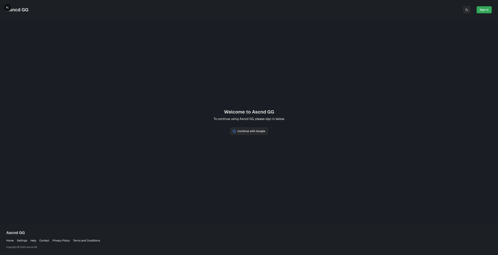

import SkillTag from "../../components/SkillTag.astro";

# {frontmatter.title}

Work in Progress

## Summary

Ascnd GG is a personal passion project that I am creating to allow for people to host and compete in Esport events
without the hassle and difficulty.

During my time at Fanshawe College, I played for the _Fanshawe Fuel_, the Fanshawe
Student Union's Esports team. During my time playing, I had the opportunity to use various platforms while playing.
None of them had all of the features that a lot of players and staff wanted. Things such as player statistics,
integrated banning system for maps, etc.

I hope to create a simple, modernized to use application that will include all of
the features that these players and staff want, along with being easy and stress-free to use.

## Tools Used

  <SkillTag>Next.js</SkillTag>
  <SkillTag>NestJS</SkillTag>
  <SkillTag>Turborepo</SkillTag>
  <SkillTag>TypeScript</SkillTag>
  <SkillTag>better-auth</SkillTag>
  <SkillTag>Zod</SkillTag>
  <SkillTag>PostgreSQL</SkillTag>
  <SkillTag>Redis</SkillTag>
  <SkillTag>Prisma</SkillTag>
  <SkillTag>S3</SkillTag>
  <SkillTag>PostHog</SkillTag>
  <SkillTag>shadcn/ui</SkillTag>
  <SkillTag>Tailwind CSS</SkillTag>
  <SkillTag>Docker</SkillTag>

## Images

  

    ### Sign in page
    

      
    

  

