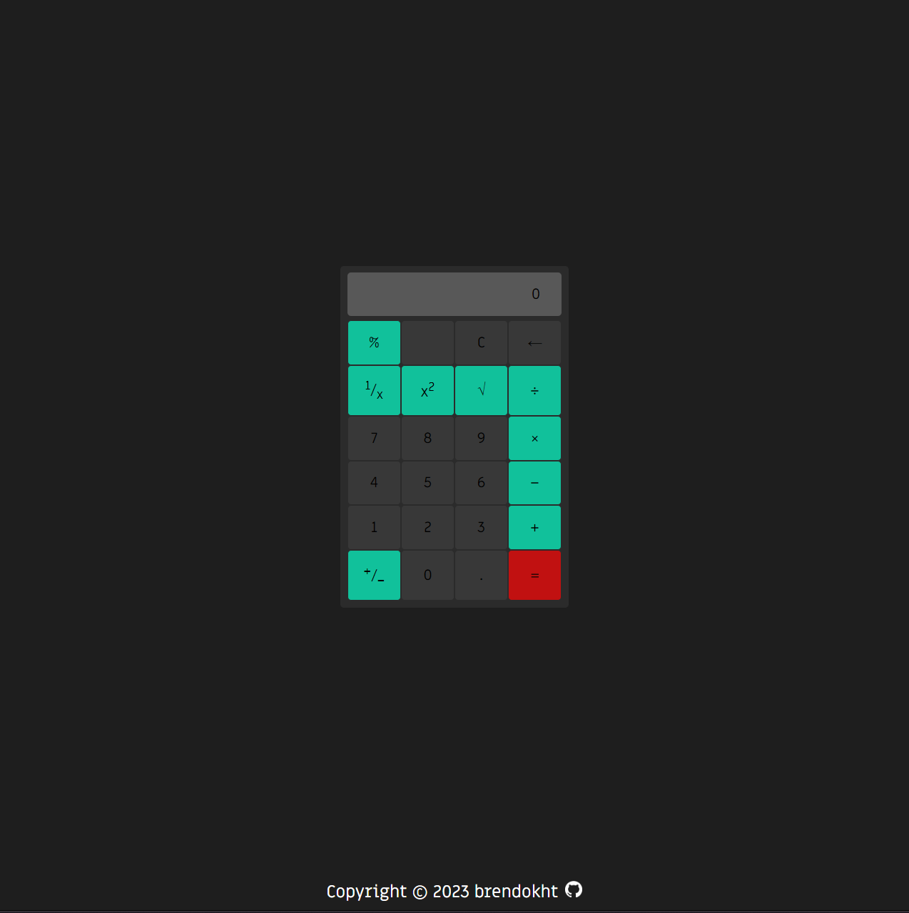

import SkillTag from "../../components/SkillTag.astro";

## Summary

This application is based of a project that is a part of _The Odin Project_.
Specifically, at the end of the _Foundations_ section as a final project for the section.
It is a simple Calculator that can do basic math, with a few more intermediate functions.

## Tools Used

    <SkillTag>HTML</SkillTag>
    <SkillTag>CSS</SkillTag>
    <SkillTag>JavaScript</SkillTag>

    

<h2 class="text-3xl font-semibold my-8">Check it out</h2>

Feel free to [<u>view it live!</u>](https://brendokht.github.io/odin-calculator/)
